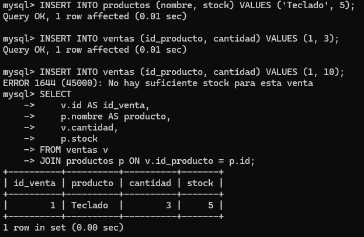
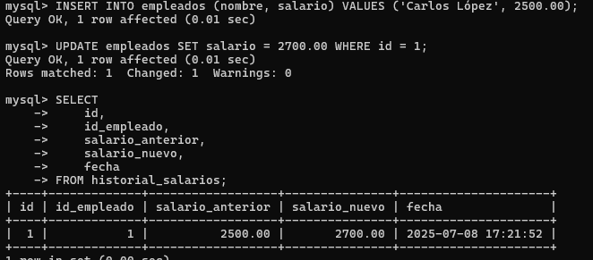
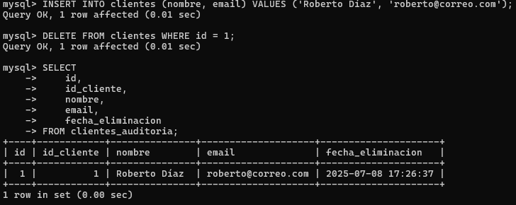
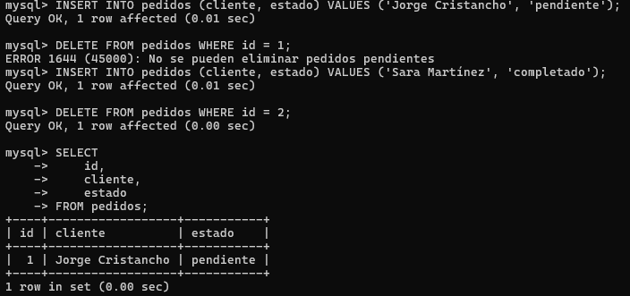

[](https://www.mysql.com/)
[](https://www.w3schools.com/sql/)
[](https://en.wikipedia.org/wiki/Relational_database)
[](https://opensource.org/licenses/MIT)
[](https://github.com/yourusername/taller-mysql)


# 🚀 **Taller de Triggers en MySQL**

## 📌 **Objetivo**

En este taller, aprenderás a utilizar **Triggers** en MySQL a través de casos prácticos. Implementarás triggers para validaciones, auditoría de cambios y registros automáticos.

------

## **🔹 Caso 1: Control de Stock de Productos**

### **Escenario:**

Una tienda en línea necesita asegurarse de que los clientes no puedan comprar más unidades de un producto del stock disponible. Si intentan hacerlo, la compra debe **bloquearse**.

### **Tarea:**

1. Crear las tablas `productos` y `ventas`.
2. Implementar un trigger `BEFORE INSERT` para evitar ventas con cantidad mayor al stock disponible.
3. Probar el trigger.

```sql
CREATE TABLE productos (
    id INT PRIMARY KEY AUTO_INCREMENT,
    nombre VARCHAR(50),
    stock INT
);

CREATE TABLE ventas (
    id INT PRIMARY KEY AUTO_INCREMENT,
    id_producto INT,
    cantidad INT,
    FOREIGN KEY (id_producto) REFERENCES productos(id)
);
```

## SOLUCION 

```mysql
DELIMITER //

CREATE TRIGGER validar_stock_venta
BEFORE INSERT ON ventas
FOR EACH ROW
BEGIN
    DECLARE disponible INT;
    
    SELECT stock INTO disponible FROM productos WHERE id = NEW.id_producto;
    
    IF NEW.cantidad > disponible THEN
        SIGNAL SQLSTATE '45000'
        SET MESSAGE_TEXT = 'No hay suficiente stock para esta venta';
    END IF;
END //

DELIMITER ;

```




## **🔹 Caso 2: Registro Automático de Cambios en Salarios**

### **Escenario:**

La empresa **TechCorp** desea mantener un registro histórico de todos los cambios de salario de sus empleados.

### **Tarea:**

1. Crear las tablas `empleados` y `historial_salarios`.
2. Implementar un trigger `BEFORE UPDATE` que registre cualquier cambio en el salario.
3. Probar el trigger.

```sql
CREATE TABLE empleados (
    id INT PRIMARY KEY AUTO_INCREMENT,
    nombre VARCHAR(50),
    salario DECIMAL(10,2)
);

CREATE TABLE historial_salarios (
    id INT PRIMARY KEY AUTO_INCREMENT,
    id_empleado INT,
    salario_anterior DECIMAL(10,2),
    salario_nuevo DECIMAL(10,2),
    fecha TIMESTAMP DEFAULT CURRENT_TIMESTAMP,
    FOREIGN KEY (id_empleado) REFERENCES empleados(id)
);
```

## SOLUCION 

```mysql
DELIMITER //

CREATE TRIGGER log_cambio_salario
BEFORE UPDATE ON empleados
FOR EACH ROW
BEGIN
    IF OLD.salario <> NEW.salario THEN
        INSERT INTO historial_salarios (id_empleado, salario_anterior, salario_nuevo)
        VALUES (OLD.id, OLD.salario, NEW.salario);
    END IF;
END //

DELIMITER ;

```




## **🔹 Caso 3: Registro de Eliminaciones en Auditoría**

### **Escenario:**

La empresa **DataSecure** quiere registrar toda eliminación de clientes en una tabla de auditoría para evitar pérdidas accidentales de datos.

### **Tarea:**

1. Crear las tablas `clientes` y `clientes_auditoria`.
2. Implementar un trigger `AFTER DELETE` para registrar los clientes eliminados.
3. Probar el trigger.

```sql
CREATE TABLE clientes (
    id INT PRIMARY KEY AUTO_INCREMENT,
    nombre VARCHAR(50),
    email VARCHAR(50)
);

CREATE TABLE clientes_auditoria (
    id INT PRIMARY KEY AUTO_INCREMENT,
    id_cliente INT,
    nombre VARCHAR(50),
    email VARCHAR(50),
    fecha_eliminacion TIMESTAMP DEFAULT CURRENT_TIMESTAMP
);
```

## SOLUCION 

```mysql
DELIMITER //

CREATE TRIGGER auditar_eliminacion_cliente
AFTER DELETE ON clientes
FOR EACH ROW
BEGIN
    INSERT INTO clientes_auditoria (id_cliente, nombre, email)
    VALUES (OLD.id, OLD.nombre, OLD.email);
END //

DELIMITER ;

```



## **🔹 Caso 4: Restricción de Eliminación de Pedidos Pendientes**

### **Escenario:**

En un sistema de ventas, no se debe permitir eliminar pedidos que aún están **pendientes**.

### **Tarea:**

1. Crear las tablas `pedidos`.
2. Implementar un trigger `BEFORE DELETE` para evitar la eliminación de pedidos pendientes.
3. Probar el trigger.

```sql
CREATE TABLE pedidos (
    id INT PRIMARY KEY AUTO_INCREMENT,
    cliente VARCHAR(100),
    estado ENUM('pendiente', 'completado')
);
```

## SOLUCION 

```mysql
DELIMITER //

CREATE TRIGGER evitar_eliminacion_pendiente
BEFORE DELETE ON pedidos
FOR EACH ROW
BEGIN
    IF OLD.estado = 'pendiente' THEN
        SIGNAL SQLSTATE '45000'
        SET MESSAGE_TEXT = 'No se pueden eliminar pedidos pendientes';
    END IF;
END //

DELIMITER ;

```




## ⚙️ Instalación y Configuración

### 📋 Prerrequisitos

- [MySQL](https://www.mysql.com/downloads/) 8.0 o superior
- [MySQL Workbench](https://www.mysql.com/products/workbench/) (opcional)
- Conocimientos básicos de SQL

### 🚀 Instalación Rápida

1. **Clonar el repositorio**
```bash
git clone https://github.com/jcristancho2/sql_Triggers.git

cd triggers_mysql
```

2. **Crear la base de datos**
```bash
mysql -u root -p < prueba_triggers.sql
```

3. **Verificar la instalación**
```sql
USE prueba_triggers;
SHOW TABLES;
```


## 💻 Autor

[**Jorge Andrés Cristancho Olarte**](https://github.com/jcristancho2)

## 📄 Licencia

Este proyecto está bajo la Licencia MIT - ver el archivo [LICENSE](LICENSE) para más detalles.

---